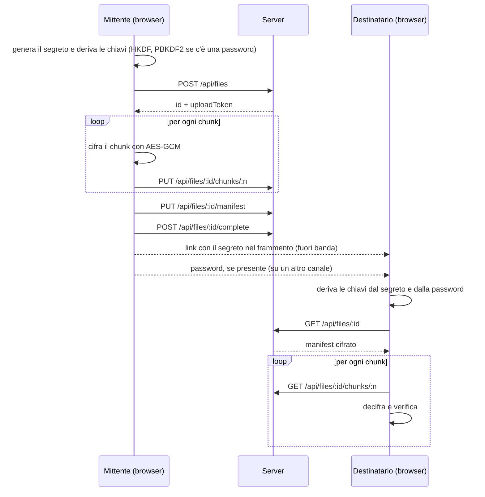

# Erchomai Transfer

Trasferimento di file con **cifratura end-to-end** nel browser. Il file viene cifrato sul dispositivo del mittente con la WebCrypto API, il server conserva solo blob opachi e il segreto da cui derivano le chiavi viaggia nel frammento del link, che il browser non invia mai al server. Una password facoltativa aggiunge un secondo fattore: senza di essa, il link da solo non basta a decifrare il file.

> **Progetto dimostrativo.** Il codice non è stato sottoposto ad audit di sicurezza indipendente e non va usato per dati reali sensibili.

---

## Indice

- [Come funziona](#come-funziona)
- [Architettura crittografica](#architettura-crittografica)
- [Threat model](#threat-model)
- [Difese implementate](#difese-implementate)
- [Limiti noti](#limiti-noti)
- [Stack](#stack)
- [Struttura del progetto](#struttura-del-progetto)
- [Avvio in locale](#avvio-in-locale)
- [Test](#test)
- [API del server](#api-del-server)
- [Roadmap](#roadmap)

---

## Come funziona

1. Il mittente sceglie un file e, se vuole, una password. Il browser genera un **segreto casuale di 256 bit** e ne deriva due chiavi AES-256: una per i blocchi del file e una per il manifest.
2. Il file viene cifrato a blocchi da 1 MiB. I blocchi cifrati e un **manifest cifrato** (nome, tipo, dimensione, numero di blocchi) vengono caricati sul server.
3. L'app produce un link nella forma `https://<host>/d/<id>#<segreto>`, oppure `#p.<segreto>` se è stata impostata una password.
4. Il destinatario apre il link: il browser legge il segreto dal frammento, chiede la password se necessaria, deriva le stesse chiavi, scarica i blocchi, li decifra e verifica l'integrità di ciascuno.

Il frammento dopo `#` non fa parte della richiesta HTTP, quindi il server non riceve mai il segreto. La password viene comunicata al destinatario su un canale diverso da quello del link.



---

## Architettura crittografica

Sono usate solo primitive standard esposte da `crypto.subtle`. Nessuna primitiva è implementata a mano.

| Elemento | Scelta | Motivazione |
| --- | --- | --- |
| Segreto | 256 bit casuali, uno per trasferimento | Materiale di partenza ad alta entropia, mai riusato |
| Trasporto del segreto | Frammento dell'URL, codifica base64url | Non viene inviato al server con la richiesta HTTP |
| Derivazione delle chiavi | HKDF-SHA256, `info` = `erchomai/v2/chunks` ed `erchomai/v2/manifest` | Una chiave per ogni uso (separazione dei domini) |
| Password facoltativa | PBKDF2-SHA256, 600.000 iterazioni, salt = segreto del link | Rende costoso ogni tentativo; il salt è unico per trasferimento senza memorizzare nulla in più |
| Cifratura | AES-256-GCM | Cifratura autenticata: riservatezza e integrità in un'unica operazione |
| Dimensione dei chunk | 1 MiB | Il file non deve stare tutto in memoria durante la cifratura |
| IV dei chunk | Nonce di base di 96 bit casuali, con gli ultimi 32 bit in XOR con l'indice del chunk | IV unico per ogni chunk sotto la stessa chiave |
| AAD dei chunk | Indice del chunk (4 byte, big-endian) e flag "ultimo chunk" (1 byte) | Lega ogni chunk alla sua posizione e rende rilevabile il troncamento |
| Manifest | JSON cifrato con la chiave dedicata, IV casuale di 96 bit, AAD `erchomai-manifest-v1` | Il server non conosce nome, tipo o dimensione esatta del file |

### Derivazione delle chiavi

```
segreto        = 32 byte casuali                                   (nel frammento del link)
pw             = PBKDF2-SHA256(password, salt = segreto, 600.000)  (solo con password)
ikm            = segreto                oppure   segreto || pw
chiaveChunk    = HKDF-SHA256(ikm, info = "erchomai/v2/chunks")
chiaveManifest = HKDF-SHA256(ikm, info = "erchomai/v2/manifest")
```

- Le due chiavi sono indipendenti: un ciphertext prodotto con una non può essere decifrato con l'altra.
- La password viene normalizzata in Unicode NFC prima della derivazione, così la stessa password produce gli stessi byte su sistemi diversi.
- Tutte le chiavi sono **non estraibili**, sia per il mittente sia per il destinatario: nemmeno il JavaScript della pagina può rileggerne i byte. Nel link viaggia il segreto, non una chiave.

### Cifratura a chunk

Ogni chunk viene cifrato in modo indipendente, ma è legato crittograficamente alla sua posizione nel file:

```
IV_n  = nonce_base XOR (0x00…00 || n)          // n = indice del chunk, 32 bit
AAD_n = n (uint32, big-endian) || isLast (1 byte)
C_n   = AES-256-GCM(chiaveChunk, IV_n, AAD_n, P_n)
```

Questo schema, una versione semplificata della costruzione STREAM, rende rilevabili tre attacchi:

- **Riordino.** Un chunk spostato in un'altra posizione viene decifrato con un indice diverso, quindi IV e AAD non corrispondono e la verifica GCM fallisce.
- **Troncamento.** Il destinatario decifra l'ultimo chunk atteso con `isLast = 1`. Se il server elimina i chunk finali, il nuovo "ultimo" era stato cifrato con `isLast = 0` e la verifica fallisce.
- **Alterazione.** Qualsiasi modifica di un byte invalida il tag di autenticazione di 128 bit.

### Manifest

Il manifest contiene `v`, `name`, `type`, `size`, `chunkCount` e il nonce di base dei chunk. Viene cifrato con la chiave dedicata e serializzato come `IV || ciphertext` in base64url.

Il numero di chunk usato dal destinatario è quello del manifest autenticato, non quello dichiarato dal server. Un'incoerenza tra i due viene segnalata come anomalia. Dopo la decifratura, la struttura del manifest viene comunque validata.

Il manifest è anche il primo elemento decifrato dal destinatario: una password errata viene rilevata qui, prima di scaricare qualsiasi chunk.

---

## Threat model

### Risorse da proteggere

- Il contenuto del file.
- I metadati del file: nome, tipo e dimensione esatta.
- L'integrità del file ricevuto.

### Attori e protezioni

| Attore | Capacità | Protetto? | Come |
| --- | --- | --- | --- |
| Server curioso (honest-but-curious) | Legge tutto ciò che conserva | Sì | Riceve solo chunk e manifest cifrati, mai il segreto né la password |
| Server malevolo sui dati | Altera, riordina, tronca o sostituisce i chunk | Sì, rilevato | AES-GCM con indice e flag di fine nell'AAD; numero di chunk dal manifest autenticato |
| Attaccante di rete | Intercetta il traffico | Sì | HTTPS in produzione, più la cifratura end-to-end |
| Terzo che conosce un ID | Prova a scrivere in un trasferimento altrui | Sì | Token di upload a 256 bit, richiesto per ogni scrittura |
| Terzo senza link | Prova a indovinare un ID | Sì | ID casuali a 128 bit e rate limiting |
| Codice iniettato nella pagina (XSS) | Prova a caricare script esterni o a inviare dati altrove | Sì, in larga parte | CSP rigida: `script-src 'self'` e `connect-src 'self'` |
| Chi intercetta il link, file **senza** password | Ottiene l'URL completo | **No** | Il link contiene il segreto: basta a decifrare |
| Chi intercetta il link, file **con** password | Ottiene l'URL completo | Parzialmente | Serve anche la password; resta possibile un attacco a dizionario offline |
| Server malevolo sul codice | Serve un JavaScript modificato | **No** | Limite strutturale della crittografia web, vedi sotto |
| Dispositivo compromesso | Malware sul client del mittente o del destinatario | **No** | Fuori dall'ambito di una web app |

---

## Difese implementate

### Client

- **Content Security Policy rigida** nella build di produzione:

  ```
  default-src 'none'; script-src 'self'; style-src 'self'; img-src 'self' data:;
  font-src 'self'; connect-src 'self'; manifest-src 'self'; worker-src 'self';
  base-uri 'none'; form-action 'none'; object-src 'none'
  ```

  - `script-src 'self'` senza `'unsafe-inline'` né `'unsafe-eval'`: gli script inline iniettati e quelli caricati da domini esterni non vengono eseguiti.
  - `connect-src 'self'`: `fetch`, XHR e WebSocket possono contattare solo il dominio dell'app, quindi un codice iniettato non può inviare il segreto o il file decifrato a un server esterno.
  - `img-src 'self' data:`: impedisce l'esfiltrazione tramite "beacon" d'immagine verso domini esterni.
  - La policy viene inserita come primo elemento di `<head>` da un plugin Vite attivo solo in build, perché in sviluppo l'hot reload di Vite richiede script inline.
- **Chiavi non estraibili** e derivate per uso, con segreto e password che non lasciano mai il browser.
- **Password facoltativa** di almeno 8 caratteri, rafforzata con PBKDF2 a 600.000 iterazioni. Viene cancellata dallo stato dell'interfaccia subito dopo l'uso.
- Il numero di chunk viene preso dal manifest autenticato, non dal server.
- Gli errori di integrità indicano quale chunk ha fallito la verifica.
- Il file ricevuto viene sempre salvato come `application/octet-stream`: il tipo MIME dichiarato dal mittente non viene mai usato, quindi un file HTML malevolo non viene interpretato nell'origine dell'app.
- Il nome del file viene ripulito da caratteri di percorso e di controllo.
- Il segreto viene rimosso dalla barra degli indirizzi subito dopo la lettura.

### Server

- **ID non indovinabili**: 128 bit da `crypto.randomBytes`.
- **Token di upload** da 256 bit: il server ne salva solo l'hash SHA-256 e lo confronta con `timingSafeEqual`.
- **Validazione con JSON Schema** di parametri e corpi. ID e indici vengono controllati prima di diventare percorsi su disco, il che impedisce il path traversal.
- **Rate limiting** con `@fastify/rate-limit`: 300 richieste al minuto per IP su tutte le rotte, ridotte a 10 al minuto per la creazione di trasferimenti, che è l'operazione che occupa spazio su disco.
- **Limiti di dimensione**: 16 KB per i corpi JSON, 1 MiB + 16 byte per i chunk, al massimo 200 chunk per trasferimento.
- **Content type rigidi**: sono accettati solo `application/json` e `application/octet-stream`.
- **Trasferimenti immutabili**: dopo `complete` le scritture vengono rifiutate con `409`.
- **Scadenza automatica** dopo 24 ore, con pulizia ogni 10 minuti.
- **Header difensivi** su ogni risposta: `Cache-Control: no-store`, `X-Content-Type-Options: nosniff`, `Referrer-Policy: no-referrer` e `Content-Security-Policy: default-src 'none'; frame-ancestors 'none'`, perché l'API restituisce solo dati e non contenuti da eseguire o incorniciare.

### Verifica della CSP

Test eseguito nella console del browser sulla build di produzione: uno script caricato da un CDN e una richiesta verso un dominio esterno vengono entrambi bloccati.

```js
const s = document.createElement('script');
s.src = 'https://cdn.jsdelivr.net/npm/lodash/lodash.min.js';
document.head.append(s);
fetch('https://example.com');
```


Per ripetere il test conviene usare un browser senza estensioni, per esempio in una finestra in incognito. Estensioni e browser integrati negli editor iniettano stili e script propri, che la CSP segnala come violazioni pur non appartenendo all'app.

---

## Limiti noti

- **Senza password, il link è la chiave.** Chi intercetta il link completo può scaricare e decifrare il file. Il canale con cui il link viene condiviso fa quindi parte del modello di sicurezza.
- **Con password, resta possibile un attacco a dizionario offline.** Chi possiede il link può scaricare il manifest cifrato e provare password senza contattare di nuovo il server, quindi il rate limiting non lo rallenta. La protezione dipende dalla robustezza della password e dal costo di PBKDF2.
- **PBKDF2 non è memory-hard.** Argon2id sarebbe più resistente agli attacchi con GPU, ma non è disponibile nella WebCrypto API e richiederebbe una libreria esterna.
- **Fiducia nel codice servito.** Come per ogni applicazione crittografica web, un server compromesso potrebbe servire un JavaScript modificato che esfiltra segreto e password. La CSP protegge da codice *iniettato* nella pagina, ma non da codice malevolo servito direttamente dall'origine.
- **La CSP non copre la navigazione.** Un codice iniettato che riuscisse a eseguire potrebbe comunque reindirizzare la pagina verso un dominio esterno, portando dati nell'URL: nessuna direttiva CSP supportata dai browser lo impedisce. La difesa principale resta impedire l'esecuzione di codice iniettato, cosa che `script-src 'self'` fa.
- **`frame-ancestors` non ancora attivo sul client.** La direttiva anti-clickjacking funziona solo come header HTTP, non dentro un meta tag. Verrà configurata negli header della piattaforma di deploy.
- **Metadati visibili al server.** Il server vede la dimensione approssimativa del file (numero e dimensione dei chunk), gli orari e gli indirizzi IP delle richieste.
- **Nessuna autenticazione del mittente.** Il destinatario sa che il file non è stato alterato dopo la cifratura, ma non può verificare chi lo ha inviato.
- **Nessuna forward secrecy.** Chi ottiene link e password prima della scadenza può decifrare il file.
- **Decifratura in memoria.** Il file decifrato viene ricomposto in un `Blob`, per questo la dimensione massima è limitata a 200 MiB.

---

## Stack

| Livello | Tecnologie |
| --- | --- |
| Client | React, Vite, `vite-plugin-pwa`, React Router |
| Crittografia | WebCrypto API (`crypto.subtle`), senza librerie esterne |
| Server | Node.js, Fastify, `@fastify/rate-limit` |
| Archiviazione | Filesystem locale |
| Test | Vitest |

---

## Struttura del progetto

```
erchomai-transfer/
├── docs/
│   └── csp-blocco.png         # prova del blocco CSP
├── client/
│   ├── vite.config.js         # PWA, proxy di sviluppo, plugin CSP
│   └── src/
│       ├── App.jsx            # router
│       ├── transfer.js        # orchestrazione invio/ricezione
│       ├── api/client.js      # chiamate HTTP
│       ├── crypto/            # solo crypto.subtle, testabile in Node
│       │   ├── encoding.js
│       │   ├── keys.js        # segreto, HKDF, PBKDF2, frammento del link
│       │   ├── chunks.js
│       │   ├── manifest.js
│       │   ├── keys.test.js
│       │   ├── chunks.test.js
│       │   └── manifest.test.js
│       └── pages/
│           ├── Upload.jsx
│           └── Download.jsx
└── server/
    ├── storage/               # blob cifrati (esclusi da Git)
    └── src/
        ├── index.js           # avvio, rate limiting, header difensivi
        ├── storage.js
        └── routes/files.js
```

---

## Avvio in locale

Requisiti: **Node.js 20 o superiore**.

```bash
# server
cd server
npm install
npm run dev        # http://127.0.0.1:3000

# client, in un secondo terminale
cd client
npm install
npm run dev        # http://localhost:5173
```

In sviluppo, Vite inoltra le richieste `/api` al server. La WebCrypto API richiede un contesto sicuro: `localhost` in sviluppo, HTTPS in produzione.

Per provare la build di produzione con la CSP attiva:

```bash
cd client
npm run build
npm run preview    # http://localhost:4173
```

---

## Test

```bash
cd client
npm test
```

La suite verifica i casi validi (round-trip di chunk, manifest e frammento del link, derivazione deterministica delle chiavi) e soprattutto i casi di attacco, che devono essere **rifiutati**:

- chunk riordinato;
- file troncato;
- byte alterato in un chunk o nel manifest;
- chiave o password errata;
- segreto di lunghezza non valida nel link;
- uso della chiave di un dominio nell'altro (chunk e manifest);
- tentativo di esportare una chiave non estraibile;
- manifest con struttura non valida.

---

## API del server

| Metodo | Endpoint | Autorizzazione | Descrizione |
| --- | --- | --- | --- |
| `POST` | `/api/files` | nessuna (max 10/min per IP) | Crea un trasferimento e restituisce `id`, `uploadToken` ed `expiresAt` |
| `PUT` | `/api/files/:id/chunks/:n` | `Bearer <uploadToken>` | Carica il chunk cifrato `n` |
| `PUT` | `/api/files/:id/manifest` | `Bearer <uploadToken>` | Carica il manifest cifrato |
| `POST` | `/api/files/:id/complete` | `Bearer <uploadToken>` | Verifica che manifest e chunk siano presenti e chiude il trasferimento |
| `GET` | `/api/files/:id` | nessuna | Restituisce manifest cifrato, numero di chunk e scadenza |
| `GET` | `/api/files/:id/chunks/:n` | nessuna | Scarica il chunk cifrato `n` |

Tutte le rotte sono soggette al limite globale di 300 richieste al minuto per IP. Oltre il limite il server risponde `429`.

---

## Roadmap

- [x] Content Security Policy rigida
- [x] Rate limiting con `@fastify/rate-limit`
- [x] Password opzionale combinata con il segreto del link
- [x] Sottochiavi separate per chunk e manifest derivate con HKDF
- [ ] Download in streaming su disco per superare il limite di memoria
- [ ] Deploy online con HTTPS, con CSP e `frame-ancestors` come header HTTP
- [ ] Modalità utente → utente con scambio di chiavi ECDH e firme ECDSA

---

## Autore

**Giulio Malini** ("Erchomai"), progetto personale di sicurezza applicativa con orientamento Blue Team.
