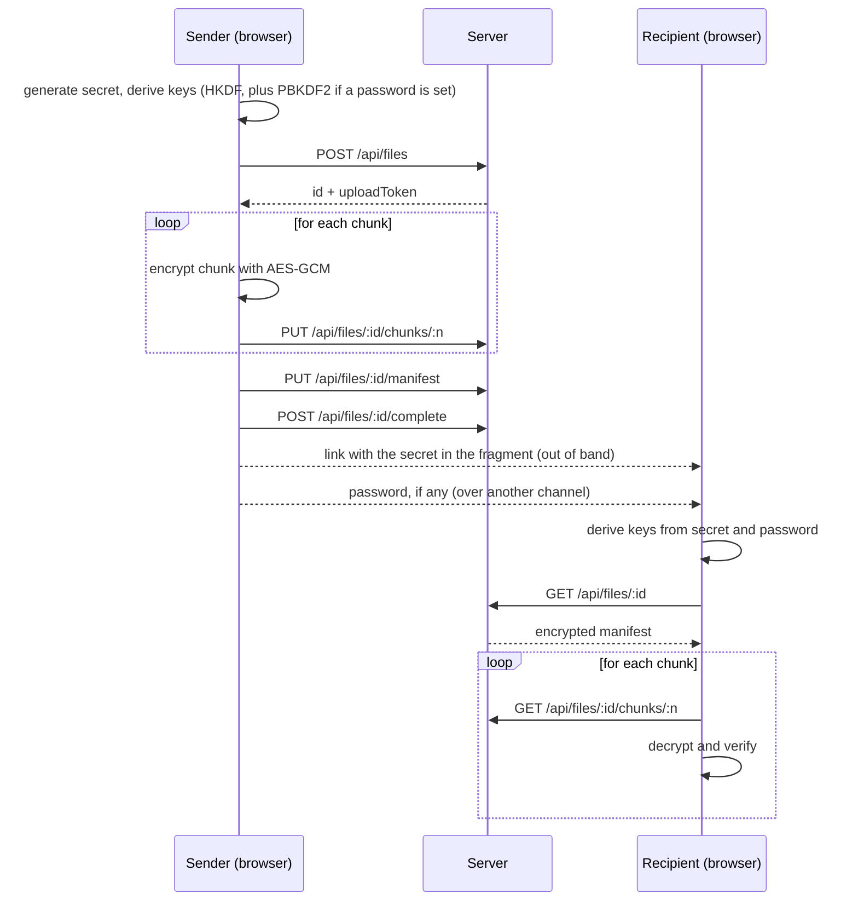
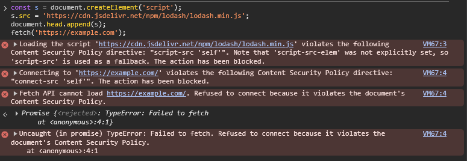

# Erchomai Transfer

**End-to-end encrypted** file transfer in the browser. Files are encrypted on the sender's device with the WebCrypto API, the server only stores opaque blobs, and the secret from which the keys are derived travels in the URL fragment, which browsers never send to the server. An optional password adds a second factor: without it, the link alone is not enough to decrypt the file.

> **Demo project.** The code has not been independently audited and should not be used for real sensitive data.

> 🇮🇹 [Versione italiana](README.it.md)

---

## Table of contents

- [Erchomai Transfer](#erchomai-transfer)
  - [Table of contents](#table-of-contents)
  - [How it works](#how-it-works)
  - [Cryptographic design](#cryptographic-design)
    - [Key derivation](#key-derivation)
    - [Chunked encryption](#chunked-encryption)
    - [Manifest](#manifest)
  - [Threat model](#threat-model)
    - [Assets](#assets)
    - [Actors and protections](#actors-and-protections)
  - [Implemented defenses](#implemented-defenses)
    - [Client](#client)
    - [Server](#server)
    - [CSP verification](#csp-verification)
  - [Known limitations](#known-limitations)
  - [Stack](#stack)
  - [Project structure](#project-structure)
  - [Running locally](#running-locally)
  - [Tests](#tests)
  - [Server API](#server-api)
  - [Roadmap](#roadmap)
  - [Author](#author)

---

## How it works

1. The sender picks a file and, optionally, a password. The browser generates a **random 256-bit secret** and derives two AES-256 keys from it: one for the file chunks and one for the manifest.
2. The file is encrypted in 1 MiB chunks. The encrypted chunks and an **encrypted manifest** (name, type, size, chunk count) are uploaded to the server.
3. The app produces a link of the form `https://<host>/d/<id>#<secret>`, or `#p.<secret>` when a password was set.
4. The recipient opens the link: the browser reads the secret from the fragment, asks for the password if needed, derives the same keys, downloads the chunks, decrypts them and verifies the integrity of each one.

The fragment after `#` is not part of the HTTP request, so the server never receives the secret. The password is shared with the recipient over a different channel than the link.



---

## Cryptographic design

Only standard primitives exposed by `crypto.subtle` are used. No primitive is implemented by hand.

| Element | Choice | Rationale |
| --- | --- | --- |
| Secret | 256 random bits, one per transfer | High-entropy starting material, never reused |
| Secret transport | URL fragment, base64url-encoded | Not sent to the server with the HTTP request |
| Key derivation | HKDF-SHA256, `info` = `erchomai/v2/chunks` and `erchomai/v2/manifest` | One key per purpose (domain separation) |
| Optional password | PBKDF2-SHA256, 600,000 iterations, salt = link secret | Makes every guess expensive; the salt is unique per transfer with nothing extra to store |
| Encryption | AES-256-GCM | Authenticated encryption: confidentiality and integrity in one operation |
| Chunk size | 1 MiB | The file never has to fit in memory during encryption |
| Chunk IV | 96-bit random base nonce, last 32 bits XORed with the chunk index | Unique IV for every chunk under the same key |
| Chunk AAD | Chunk index (4 bytes, big-endian) and "last chunk" flag (1 byte) | Binds each chunk to its position and makes truncation detectable |
| Manifest | JSON encrypted with its dedicated key, random 96-bit IV, AAD `erchomai-manifest-v1` | The server does not learn the file's name, type or exact size |

### Key derivation

```
secret       = 32 random bytes                                    (in the link fragment)
pw           = PBKDF2-SHA256(password, salt = secret, 600,000)    (only with a password)
ikm          = secret                 or   secret || pw
chunkKey     = HKDF-SHA256(ikm, info = "erchomai/v2/chunks")
manifestKey  = HKDF-SHA256(ikm, info = "erchomai/v2/manifest")
```

- The two keys are independent: ciphertext produced with one cannot be decrypted with the other.
- The password is normalized to Unicode NFC before derivation, so the same password yields the same bytes across systems.
- All keys are **non-extractable**, for both sender and recipient: not even the page's own JavaScript can read their bytes. The link carries the secret, never a key.

### Chunked encryption

Each chunk is encrypted independently but cryptographically bound to its position in the file:

```
IV_n  = base_nonce XOR (0x00…00 || n)          // n = chunk index, 32 bits
AAD_n = n (uint32, big-endian) || isLast (1 byte)
C_n   = AES-256-GCM(chunkKey, IV_n, AAD_n, P_n)
```

This scheme, a simplified version of the STREAM construction, makes three attacks detectable:

- **Reordering.** A chunk moved to another position is decrypted with a different index, so IV and AAD do not match and GCM verification fails.
- **Truncation.** The recipient decrypts the last expected chunk with `isLast = 1`. If the server drops the final chunks, the new "last" one was encrypted with `isLast = 0` and verification fails.
- **Tampering.** Changing any single byte invalidates the 128-bit authentication tag.

### Manifest

The manifest holds `v`, `name`, `type`, `size`, `chunkCount` and the chunks' base nonce. It is encrypted with its dedicated key and serialized as `IV || ciphertext` in base64url.

The chunk count used by the recipient comes from the authenticated manifest, not from the server's response. Any mismatch between the two is reported as an anomaly. After decryption, the manifest's structure is still validated.

The manifest is also the first thing the recipient decrypts: a wrong password is detected here, before any chunk is downloaded.

---

## Threat model

### Assets

- The file contents.
- The file metadata: name, type and exact size.
- The integrity of the received file.

### Actors and protections

| Actor | Capability | Protected? | How |
| --- | --- | --- | --- |
| Curious server (honest-but-curious) | Reads everything it stores | Yes | Receives only encrypted chunks and manifest, never the secret or the password |
| Server malicious on data | Alters, reorders, truncates or replaces chunks | Yes, detected | AES-GCM with index and end flag in the AAD; chunk count from the authenticated manifest |
| Network attacker | Intercepts traffic | Yes | HTTPS in production, plus end-to-end encryption |
| Third party who knows an ID | Tries to write into someone else's transfer | Yes | 256-bit upload token required for every write |
| Third party without the link | Tries to guess an ID | Yes | Random 128-bit IDs and rate limiting |
| Code injected into the page (XSS) | Tries to load external scripts or send data elsewhere | Largely | Strict CSP: `script-src 'self'` and `connect-src 'self'` |
| Link interceptor, file **without** password | Obtains the full URL | **No** | The link contains the secret, which is enough to decrypt |
| Link interceptor, file **with** password | Obtains the full URL | Partially | The password is also required; an offline dictionary attack remains possible |
| Server malicious on code | Serves modified JavaScript | **No** | Structural limit of web cryptography, see below |
| Compromised device | Malware on the sender's or recipient's machine | **No** | Out of scope for a web app |

---

## Implemented defenses

### Client

- **Strict Content Security Policy** in the production build:

  ```
  default-src 'none'; script-src 'self'; style-src 'self'; img-src 'self' data:;
  font-src 'self'; connect-src 'self'; manifest-src 'self'; worker-src 'self';
  base-uri 'none'; form-action 'none'; object-src 'none'
  ```

  - `script-src 'self'` without `'unsafe-inline'` or `'unsafe-eval'`: injected inline scripts and scripts loaded from external domains do not run.
  - `connect-src 'self'`: `fetch`, XHR and WebSocket can only reach the app's own origin, so injected code cannot send the secret or the decrypted file to an external server.
  - `img-src 'self' data:`: prevents exfiltration through image "beacons" to external domains.
  - The policy is inserted as the first element of `<head>` by a Vite plugin that runs only at build time, because Vite's hot reload needs inline scripts during development.
- **Non-extractable keys**, derived per purpose; the secret and the password never leave the browser.
- **Optional password** of at least 8 characters, strengthened with 600,000 PBKDF2 iterations. It is cleared from the UI state right after use.
- The chunk count is taken from the authenticated manifest, not from the server.
- Integrity errors report which chunk failed verification.
- The received file is always saved as `application/octet-stream`: the MIME type declared by the sender is never used, so a malicious HTML file is never rendered in the app's origin.
- The file name is stripped of path and control characters.
- The secret is removed from the address bar immediately after being read.

### Server

- **Unguessable IDs**: 128 bits from `crypto.randomBytes`.
- **256-bit upload token**: the server stores only its SHA-256 hash and compares it with `timingSafeEqual`.
- **JSON Schema validation** of parameters and bodies. IDs and indexes are checked before they become paths on disk, which rules out path traversal.
- **Rate limiting** with `@fastify/rate-limit`: 300 requests per minute per IP on all routes, reduced to 10 per minute for transfer creation, the operation that consumes disk space.
- **Size limits**: 16 KB for JSON bodies, 1 MiB + 16 bytes for chunks, at most 200 chunks per transfer.
- **Strict content types**: only `application/json` and `application/octet-stream` are accepted.
- **Immutable transfers**: after `complete`, writes are rejected with `409`.
- **Automatic expiry** after 24 hours, with cleanup every 10 minutes.
- **Defensive headers** on every response: `Cache-Control: no-store`, `X-Content-Type-Options: nosniff`, `Referrer-Policy: no-referrer` and `Content-Security-Policy: default-src 'none'; frame-ancestors 'none'`, since the API only returns data, never content to execute or frame.

### CSP verification

Test run in the browser console against the production build: a script loaded from a CDN and a request to an external domain are both blocked.

```js
const s = document.createElement('script');
s.src = 'https://cdn.jsdelivr.net/npm/lodash/lodash.min.js';
document.head.append(s);
fetch('https://example.com');
```



To repeat the test, use a browser without extensions, for example an incognito window. Extensions and browsers embedded in code editors inject their own styles and scripts, which the CSP reports as violations even though they do not belong to the app.

---

## Known limitations

- **Without a password, the link is the key.** Anyone who intercepts the full link can download and decrypt the file. The channel used to share the link is therefore part of the security model.
- **With a password, an offline dictionary attack is still possible.** Whoever holds the link can download the encrypted manifest and try passwords without contacting the server again, so rate limiting does not slow them down. Protection depends on password strength and on the cost of PBKDF2.
- **PBKDF2 is not memory-hard.** Argon2id would resist GPU attacks better, but it is not available in the WebCrypto API and would require an external library.
- **Trust in the served code.** As with any web-based cryptographic application, a compromised server could serve modified JavaScript that exfiltrates the secret and the password. The CSP protects against code *injected* into the page, not against malicious code served directly by the origin.
- **The CSP does not cover navigation.** Injected code that managed to run could still redirect the page to an external domain, carrying data in the URL: no CSP directive supported by browsers prevents this. The main defense remains preventing injected code from executing, which `script-src 'self'` does.
- **`frame-ancestors` not yet active on the client.** The anti-clickjacking directive only works as an HTTP header, not inside a meta tag. It will be configured in the deployment platform's headers.
- **Metadata visible to the server.** The server sees the approximate file size (number and size of chunks), request times and IP addresses.
- **No sender authentication.** The recipient knows the file was not altered after encryption, but cannot verify who sent it.
- **No forward secrecy.** Anyone who obtains the link and password before expiry can decrypt the file.
- **In-memory decryption.** The decrypted file is reassembled into a `Blob`, which is why the maximum size is limited to 200 MiB.

---

## Stack

| Layer | Technologies |
| --- | --- |
| Client | React, Vite, `vite-plugin-pwa`, React Router |
| Cryptography | WebCrypto API (`crypto.subtle`), no external libraries |
| Server | Node.js, Fastify, `@fastify/rate-limit` |
| Storage | Local filesystem |
| Tests | Vitest |

---

## Project structure

```
erchomai-transfer/
├── docs/
│   └── csp-blocco.png         # proof of CSP blocking
├── client/
│   ├── vite.config.js         # PWA, dev proxy, CSP plugin
│   └── src/
│       ├── App.jsx            # router
│       ├── transfer.js        # send/receive orchestration
│       ├── api/client.js      # HTTP calls
│       ├── crypto/            # crypto.subtle only, testable in Node
│       │   ├── encoding.js
│       │   ├── keys.js        # secret, HKDF, PBKDF2, link fragment
│       │   ├── chunks.js
│       │   ├── manifest.js
│       │   ├── keys.test.js
│       │   ├── chunks.test.js
│       │   └── manifest.test.js
│       └── pages/
│           ├── Upload.jsx
│           └── Download.jsx
└── server/
    ├── storage/               # encrypted blobs (excluded from Git)
    └── src/
        ├── index.js           # startup, rate limiting, defensive headers
        ├── storage.js
        └── routes/files.js
```

---

## Running locally

Requirements: **Node.js 20 or later**.

```bash
# server
cd server
npm install
npm run dev        # http://127.0.0.1:3000

# client, in a second terminal
cd client
npm install
npm run dev        # http://localhost:5173
```

In development, Vite proxies `/api` requests to the server. The WebCrypto API requires a secure context: `localhost` in development, HTTPS in production.

To try the production build with the CSP enabled:

```bash
cd client
npm run build
npm run preview    # http://localhost:4173
```

---

## Tests

```bash
cd client
npm test
```

The suite covers the valid cases (round-trips of chunks, manifest and link fragment, deterministic key derivation) and, above all, the attack cases, which must be **rejected**:

- reordered chunk;
- truncated file;
- altered byte in a chunk or in the manifest;
- wrong key or wrong password;
- secret of invalid length in the link;
- using one domain's key in the other (chunks vs manifest);
- attempting to export a non-extractable key;
- manifest with an invalid structure.

---

## Server API

| Method | Endpoint | Authorization | Description |
| --- | --- | --- | --- |
| `POST` | `/api/files` | none (max 10/min per IP) | Creates a transfer and returns `id`, `uploadToken` and `expiresAt` |
| `PUT` | `/api/files/:id/chunks/:n` | `Bearer <uploadToken>` | Uploads encrypted chunk `n` |
| `PUT` | `/api/files/:id/manifest` | `Bearer <uploadToken>` | Uploads the encrypted manifest |
| `POST` | `/api/files/:id/complete` | `Bearer <uploadToken>` | Checks that manifest and chunks are present and closes the transfer |
| `GET` | `/api/files/:id` | none | Returns the encrypted manifest, chunk count and expiry |
| `GET` | `/api/files/:id/chunks/:n` | none | Downloads encrypted chunk `n` |

All routes are subject to the global limit of 300 requests per minute per IP. Beyond that, the server responds with `429`.

---

## Roadmap

- [x] Strict Content Security Policy
- [x] Rate limiting with `@fastify/rate-limit`
- [x] Optional password combined with the link secret
- [x] Separate subkeys for chunks and manifest derived with HKDF
- [ ] Streaming download to disk to lift the memory limit
- [ ] Online deployment with HTTPS, with CSP and `frame-ancestors` as HTTP headers
- [ ] User-to-user mode with ECDH key exchange and ECDSA signatures

---

## Author

**Giulio Malini** ("Erchomai"), personal application-security project with a Blue Team focus.
