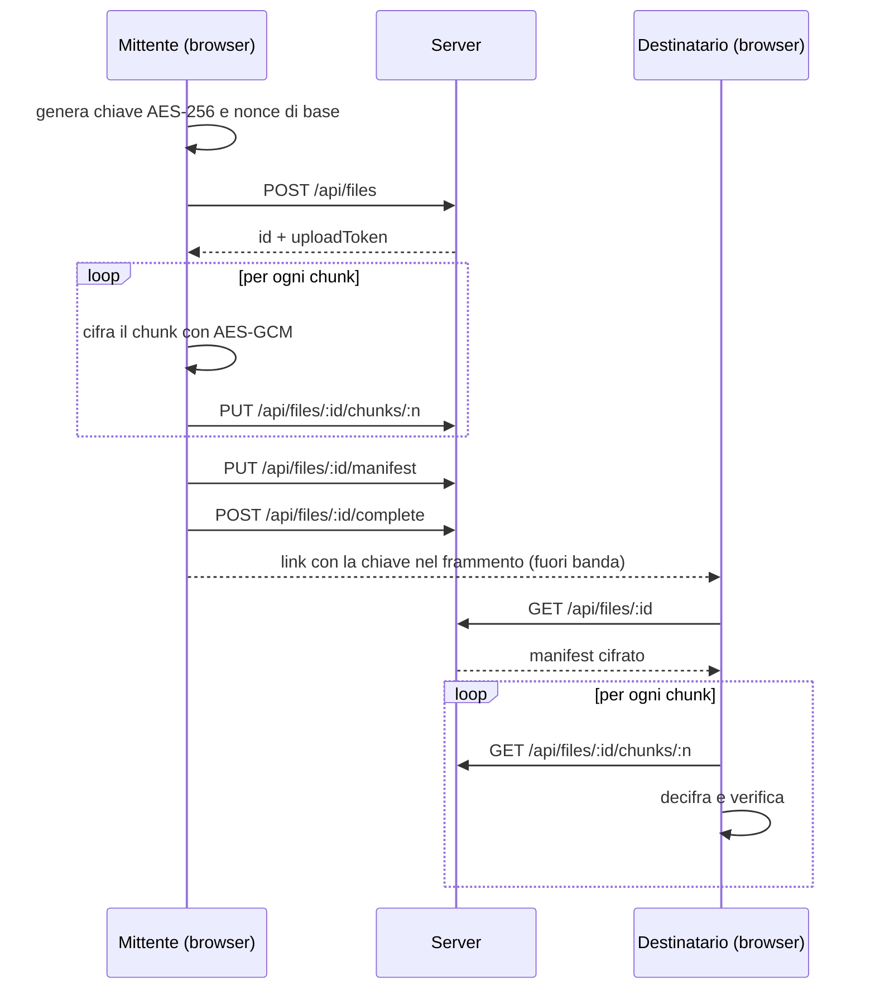

# Erchomai Transfer

Trasferimento di file con **cifratura end-to-end** nel browser. Il file viene cifrato sul dispositivo del mittente con la WebCrypto API, il server conserva solo blob opachi e la chiave viaggia nel frammento del link, che il browser non invia mai al server.

> **Progetto dimostrativo.** Il codice non è stato sottoposto ad audit di sicurezza indipendente e non va usato per dati reali sensibili.

---

## Indice

- [Erchomai Transfer](#erchomai-transfer)
  - [Indice](#indice)
  - [Come funziona](#come-funziona)
  - [Architettura crittografica](#architettura-crittografica)
    - [Cifratura a chunk](#cifratura-a-chunk)
    - [Manifest](#manifest)
    - [Gestione delle chiavi](#gestione-delle-chiavi)
  - [Threat model](#threat-model)
    - [Risorse da proteggere](#risorse-da-proteggere)
    - [Attori e protezioni](#attori-e-protezioni)
  - [Difese implementate](#difese-implementate)
    - [Server](#server)
    - [Client](#client)
  - [Limiti noti](#limiti-noti)
  - [Stack](#stack)
  - [Struttura del progetto](#struttura-del-progetto)
  - [Avvio in locale](#avvio-in-locale)
  - [Test](#test)
  - [API del server](#api-del-server)
  - [Roadmap](#roadmap)
  - [Autore](#autore)

---

## Come funziona

1. Il mittente sceglie un file. Il browser genera una **chiave AES-256 casuale** e cifra il file a blocchi da 1 MiB.
2. I blocchi cifrati e un **manifest cifrato** (nome, tipo, dimensione, numero di blocchi) vengono caricati sul server.
3. L'app produce un link nella forma `https://<host>/d/<id>#<chiave>`.
4. Il destinatario apre il link: il browser legge la chiave dal frammento, scarica i blocchi, li decifra e verifica l'integrità di ciascuno.

Il frammento dopo `#` non fa parte della richiesta HTTP, quindi il server non riceve mai la chiave.



---

## Architettura crittografica

Sono usate solo primitive standard esposte da `crypto.subtle`. Nessuna primitiva è implementata a mano.

| Elemento | Scelta | Motivazione |
| --- | --- | --- |
| Cifratura | AES-256-GCM | Cifratura autenticata: riservatezza e integrità in un'unica operazione |
| Chiave | 256 bit casuali, una per file | Nessun riuso tra file diversi |
| Trasporto della chiave | Frammento dell'URL, codifica base64url | Non viene inviato al server con la richiesta HTTP |
| Dimensione dei chunk | 1 MiB | Il file non deve stare tutto in memoria durante la cifratura |
| IV dei chunk | Nonce di base di 96 bit casuali, con gli ultimi 32 bit in XOR con l'indice del chunk | IV unico per ogni chunk sotto la stessa chiave |
| AAD dei chunk | Indice del chunk (4 byte, big-endian) e flag "ultimo chunk" (1 byte) | Lega ogni chunk alla sua posizione e rende rilevabile il troncamento |
| Manifest | JSON cifrato con AES-GCM, IV casuale di 96 bit, AAD `erchomai-manifest-v1` | Il server non conosce nome, tipo o dimensione esatta del file |

### Cifratura a chunk

Ogni chunk viene cifrato in modo indipendente, ma è legato crittograficamente alla sua posizione nel file:

```
IV_n  = nonce_base XOR (0x00…00 || n)          // n = indice del chunk, 32 bit
AAD_n = n (uint32, big-endian) || isLast (1 byte)
C_n   = AES-256-GCM(chiave, IV_n, AAD_n, P_n)
```

Questo schema, una versione semplificata della costruzione STREAM, rende rilevabili tre attacchi:

- **Riordino.** Un chunk spostato in un'altra posizione viene decifrato con un indice diverso, quindi IV e AAD non corrispondono e la verifica GCM fallisce.
- **Troncamento.** Il destinatario decifra l'ultimo chunk atteso con `isLast = 1`. Se il server elimina i chunk finali, il nuovo "ultimo" era stato cifrato con `isLast = 0` e la verifica fallisce.
- **Alterazione.** Qualsiasi modifica di un byte invalida il tag di autenticazione di 128 bit.

### Manifest

Il manifest contiene `v`, `name`, `type`, `size`, `chunkCount` e il nonce di base dei chunk. Viene serializzato come `IV || ciphertext` in base64url.

Il numero di chunk usato dal destinatario è quello del manifest autenticato, non quello dichiarato dal server. Un'incoerenza tra i due viene segnalata come anomalia. Dopo la decifratura, la struttura del manifest viene comunque validata.

### Gestione delle chiavi

- Lato mittente la chiave è estraibile, perché deve essere esportata nel link.
- Lato destinatario la chiave viene importata come **non estraibile** e con il solo uso `decrypt`: nemmeno il JavaScript della pagina può rileggerne i byte.
- Dopo la lettura, la chiave viene rimossa dalla barra degli indirizzi con `history.replaceState`.

---

## Threat model

### Risorse da proteggere

- Il contenuto del file.
- I metadati del file: nome, tipo e dimensione esatta.
- L'integrità del file ricevuto.

### Attori e protezioni

| Attore | Capacità | Protetto? | Come |
| --- | --- | --- | --- |
| Server curioso (honest-but-curious) | Legge tutto ciò che conserva | Sì | Riceve solo chunk e manifest cifrati, mai la chiave |
| Server malevolo sui dati | Altera, riordina, tronca o sostituisce i chunk | Sì, rilevato | AES-GCM con indice e flag di fine nell'AAD; numero di chunk dal manifest autenticato |
| Attaccante di rete | Intercetta il traffico | Sì | HTTPS in produzione, più la cifratura end-to-end |
| Terzo che conosce un ID | Prova a scrivere in un trasferimento altrui | Sì | Token di upload a 256 bit, richiesto per ogni scrittura |
| Terzo senza link | Prova a indovinare un ID | Sì | ID casuali a 128 bit |
| Chi intercetta il link | Ottiene l'URL completo | **No** | Il link contiene la chiave: chi lo possiede può decifrare il file |
| Server malevolo sul codice | Serve un JavaScript modificato | **No** | Limite strutturale della crittografia web, vedi sotto |
| Dispositivo compromesso | Malware sul client del mittente o del destinatario | **No** | Fuori dall'ambito di una web app |

---

## Difese implementate

### Server

- **ID non indovinabili**: 128 bit da `crypto.randomBytes`.
- **Token di upload** da 256 bit: il server ne salva solo l'hash SHA-256 e lo confronta con `timingSafeEqual`.
- **Validazione con JSON Schema** di parametri e corpi. ID e indici vengono controllati prima di diventare percorsi su disco, il che impedisce il path traversal.
- **Limiti di dimensione**: 16 KB per i corpi JSON, 1 MiB + 16 byte per i chunk, al massimo 200 chunk per trasferimento.
- **Content type rigidi**: sono accettati solo `application/json` e `application/octet-stream`.
- **Trasferimenti immutabili**: dopo `complete` le scritture vengono rifiutate con `409`.
- **Scadenza automatica** dopo 24 ore, con pulizia ogni 10 minuti.
- **Header difensivi**: `Cache-Control: no-store`, `X-Content-Type-Options: nosniff`, `Referrer-Policy: no-referrer`.

### Client

- Il numero di chunk viene preso dal manifest autenticato, non dal server.
- Gli errori di integrità indicano quale chunk ha fallito la verifica.
- Il file ricevuto viene sempre salvato come `application/octet-stream`: il tipo MIME dichiarato dal mittente non viene mai usato, quindi un file HTML malevolo non viene interpretato nell'origine dell'app.
- Il nome del file viene ripulito da caratteri di percorso e di controllo.
- La chiave viene importata come non estraibile e rimossa dalla barra degli indirizzi.

---

## Limiti noti

- **Il link è la chiave.** Chi intercetta il link completo può scaricare e decifrare il file. Il canale con cui il link viene condiviso fa quindi parte del modello di sicurezza.
- **Fiducia nel codice servito.** Come per ogni applicazione crittografica web, un server compromesso potrebbe servire un JavaScript modificato che esfiltra la chiave. Le mitigazioni previste (CSP rigida, nessuno script di terze parti, versione dell'app fissata dal service worker) riducono il rischio ma non lo eliminano.
- **Metadati visibili al server.** Il server vede la dimensione approssimativa del file (numero e dimensione dei chunk), gli orari e gli indirizzi IP delle richieste.
- **Nessuna autenticazione del mittente.** Il destinatario sa che il file non è stato alterato dopo la cifratura, ma non può verificare chi lo ha inviato.
- **Nessuna forward secrecy.** Chi ottiene il link prima della scadenza può decifrare il file.
- **Chiave condivisa tra chunk e manifest.** I due usi sono separati da IV distinti e AAD diversi. Una versione futura potrebbe derivare sottochiavi dedicate con HKDF.
- **Decifratura in memoria.** Il file decifrato viene ricomposto in un `Blob`, per questo la dimensione massima è limitata a 200 MiB.

---

## Stack

| Livello | Tecnologie |
| --- | --- |
| Client | React, Vite, `vite-plugin-pwa`, React Router |
| Crittografia | WebCrypto API (`crypto.subtle`), senza librerie esterne |
| Server | Node.js, Fastify |
| Archiviazione | Filesystem locale |
| Test | Vitest |

---

## Struttura del progetto

```
erchomai-transfer/
├── client/
│   ├── vite.config.js
│   └── src/
│       ├── App.jsx            # router
│       ├── transfer.js        # orchestrazione invio/ricezione
│       ├── api/client.js      # chiamate HTTP
│       ├── crypto/            # solo crypto.subtle, testabile in Node
│       │   ├── encoding.js
│       │   ├── keys.js
│       │   ├── chunks.js
│       │   ├── manifest.js
│       │   ├── chunks.test.js
│       │   └── manifest.test.js
│       └── pages/
│           ├── Upload.jsx
│           └── Download.jsx
└── server/
    ├── storage/               # blob cifrati (esclusi da Git)
    └── src/
        ├── index.js
        ├── storage.js
        └── routes/files.js
```

---

## Avvio in locale

Requisiti: **Node.js 20 o superiore**.

```bash
# server
cd server
npm install
npm run dev        # http://127.0.0.1:3000

# client, in un secondo terminale
cd client
npm install
npm run dev        # http://localhost:5173
```

In sviluppo, Vite inoltra le richieste `/api` al server. La WebCrypto API richiede un contesto sicuro: `localhost` in sviluppo, HTTPS in produzione.

---

## Test

```bash
cd client
npm test
```

La suite verifica i casi validi (round-trip di chunk, manifest e chiave nel link) e soprattutto i casi di attacco, che devono essere **rifiutati**:

- chunk riordinato;
- file troncato;
- byte alterato in un chunk o nel manifest;
- chiave errata o di lunghezza non valida;
- manifest con struttura non valida.

---

## API del server

| Metodo | Endpoint | Autorizzazione | Descrizione |
| --- | --- | --- | --- |
| `POST` | `/api/files` | nessuna | Crea un trasferimento e restituisce `id`, `uploadToken` ed `expiresAt` |
| `PUT` | `/api/files/:id/chunks/:n` | `Bearer <uploadToken>` | Carica il chunk cifrato `n` |
| `PUT` | `/api/files/:id/manifest` | `Bearer <uploadToken>` | Carica il manifest cifrato |
| `POST` | `/api/files/:id/complete` | `Bearer <uploadToken>` | Verifica che manifest e chunk siano presenti e chiude il trasferimento |
| `GET` | `/api/files/:id` | nessuna | Restituisce manifest cifrato, numero di chunk e scadenza |
| `GET` | `/api/files/:id/chunks/:n` | nessuna | Scarica il chunk cifrato `n` |

---

## Roadmap

- [ ] Content Security Policy rigida
- [ ] Rate limiting con `@fastify/rate-limit`
- [ ] Deploy online con HTTPS
- [ ] Password opzionale combinata con la chiave del link
- [ ] Sottochiavi separate per chunk e manifest derivate con HKDF
- [ ] Download in streaming su disco per superare il limite di memoria
- [ ] Modalità utente → utente con scambio di chiavi ECDH e firme ECDSA

---

## Autore

**Giulio Malini** ("Erchomai"), progetto personale di sicurezza applicativa con orientamento Blue Team.